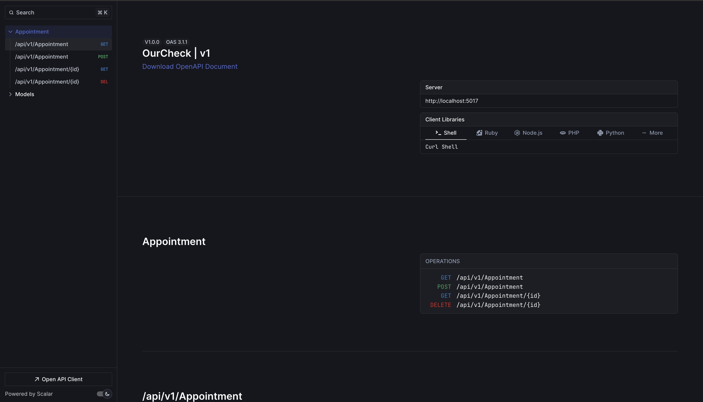

# OurCheck

**A production-ready appointment management system built with ASP.NET Core.** Demonstrates enterprise-level architectural patterns, clean code principles, and modern .NET development practices.

[](https://dotnet.microsoft.com/)
[](LICENSE)
[]()
[](https://www.docker.com/)

---

## 📸 Screenshots


<!-- Add Scalar UI screenshot here -->

---

## ✨ Features

- **Full CRUD Operations** for appointment management
- **RESTful API** with versioning support (v1.0)
- **Interactive API Documentation** powered by Scalar UI
- **Global Exception Handling** with RFC 7807 Problem Details
- **Request/Response Logging** with correlation IDs for traceability
- **Automatic Validation** using FluentValidation pipeline
- **Database Migrations** with Entity Framework Core
- **Data Seeding** for quick development startup
- **Containerized Deployment** with Docker and Docker Compose
- **Health Checks** for PostgreSQL database

---

## 🛠️ Tech Stack

### **Core Framework**
| Technology | Purpose |
|------------|---------|
| **.NET 10** | Runtime and SDK |
| **ASP.NET Core 10** | Web API framework |
| **C# 13** | Programming language |

### **Data Access**
| Technology | Purpose |
|------------|---------|
| **Entity Framework Core 10** | ORM for database operations |
| **Npgsql.EntityFrameworkCore.PostgreSQL** | PostgreSQL provider |
| **PostgreSQL 17 (Alpine)** | Relational database |

### **Architecture & Patterns**
| Technology | Purpose |
|------------|---------|
| **MediatR 12.2** | CQRS and mediator pattern implementation |
| **FluentValidation 11.9** | Model validation |

### **API Documentation**
| Technology | Purpose |
|------------|---------|
| **Scalar 2.1** | Modern API documentation UI |
| **Microsoft.AspNetCore.OpenApi** | OpenAPI specification generation |
| **Asp.Versioning** | API versioning support |

### **Logging & Observability**
| Technology | Purpose |
|------------|---------|
| **Serilog 10.0** | Structured logging |

### **DevOps**
| Technology | Purpose |
|------------|---------|
| **Docker** | Containerization |
| **Docker Compose** | Multi-container orchestration |

---

## 🏗️ Architecture

This project follows **Clean Architecture** principles with **Vertical Slice Architecture** for feature organization, implementing:

- **CQRS (Command Query Responsibility Segregation)**: Separate models for read and write operations
- **MediatR Pipeline Behaviors**: Cross-cutting concerns handled via:
  - `RequestResponseLoggingBehavior`: Structured logging with correlation IDs
  - `ValidationBehavior`: Automatic request validation before handler execution
- **Repository Pattern**: Abstracted via EF Core DbContext
- **Domain-Driven Design**: Domain entities with encapsulated business logic
- **Global Exception Handling**: Centralized error handling with RFC 7807 Problem Details responses
- **API Versioning**: URL segment-based versioning with header fallback support
- **Feature-Based Organization**: Each feature (e.g., Appointment) contains its Commands, Queries, DTOs, and Validators

### Project Structure

```
OurCheck/
├── Behaviors/              # MediatR pipeline behaviors
│   ├── RequestResponseLoggingBehavior.cs
│   └── ValidationBehavior.cs
├── Controllers/            # API controllers
│   └── AppointmentController.cs
├── Domain/                 # Domain entities and base classes
│   ├── Appointment.cs
│   └── EntityBase.cs
├── Exceptions/             # Global exception handling
│   └── GlobalExceptionHandler.cs
├── Features/               # Vertical slices by feature
│   └── Appointment/
│       ├── Commands/
│       │   ├── Create/
│       │   └── Delete/
│       ├── Queries/
│       │   ├── Get/
│       │   └── List/
│       └── Dtos/
├── Persistence/            # Data access layer
│   ├── AppDbContext.cs
│   └── Configurations/
│       ├── AppointmentConfiguration.cs
│       └── AppointmentQueryFilter.cs
└── Migrations/             # EF Core migrations
```

---

## 🚀 Getting Started

### Prerequisites

Ensure you have the following installed:

- **.NET 10 SDK** ([Download](https://dotnet.microsoft.com/download/dotnet/10.0))
- **Docker Desktop** ([Download](https://www.docker.com/products/docker-desktop))
- **Entity Framework Core CLI Tools**:
  ```bash
  dotnet tool install --global dotnet-ef
  ```

### Setup Instructions

1. **Clone the repository**
   ```bash
   git clone https://github.com/yourusername/OurCheck.git
   cd OurCheck
   ```

2. **Start PostgreSQL with Docker**
   ```bash
   docker compose up -d
   ```
   This will start a PostgreSQL 17 container on `localhost:5432` with:
   - Username: `admin`
   - Password: `secret`
   - Database: `ourCheck`

3. **Restore NuGet packages**
   ```bash
   dotnet restore
   ```

4. **Apply database migrations**
   ```bash
   dotnet ef database update --project OurCheck
   ```
   > **Note:** The database will be seeded automatically on first run with sample data.

5. **Run the application**
   ```bash
   dotnet run --project OurCheck
   ```

6. **Access the application**
   - **HTTPS**: [https://localhost:7198](https://localhost:7198)
   - **HTTP**: [http://localhost:5017](http://localhost:5017)
   - **API Documentation (Scalar)**: [https://localhost:7198/scalar/v1](https://localhost:7198/scalar/v1)

---

## 📚 API Documentation

Once the application is running, navigate to the **Scalar UI** at:

```
https://localhost:7198/scalar/v1
```

Here you can:
- Explore all available endpoints
- Test API requests interactively
- View request/response schemas
- Download the OpenAPI specification

### Available Endpoints (v1)

| Method | Endpoint | Description |
|--------|----------|-------------|
| GET | `/api/v1/Appointment` | List all appointments |
| GET | `/api/v1/Appointment/{id}` | Get appointment by ID |
| POST | `/api/v1/Appointment` | Create new appointment |
| DELETE | `/api/v1/Appointment/{id}` | Delete appointment |

---

## 🧪 Testing

```bash
# Run all tests
dotnet test

# Run tests with coverage
dotnet test /p:CollectCoverage=true
```

> **Note:** Test project not yet implemented. See [Future Improvements](#-future-improvements).

---

## 🐳 Docker Deployment

### Build and run with Docker

```bash
# Build the Docker image
docker build -t ourcheck:latest -f OurCheck/Dockerfile .

# Run the container
docker run -p 5017:8080 --env-file .env ourcheck:latest
```

### Docker Compose (Full Stack)

```bash
# Start all services (API + PostgreSQL)
docker compose up --build

# Stop all services
docker compose down

# Stop and remove volumes
docker compose down -v
```

---

## 🔧 Configuration

### Database Connection

Edit `appsettings.json` to configure your connection string:

```json
{
  "ConnectionStrings": {
    "DefaultConnection": "Host=localhost;Port=5432;Database=ourCheck;Username=admin;Password=secret"
  }
}
```

### Logging

Serilog is configured in `Program.cs`. Default output is console. To configure additional sinks, modify:

```csharp
builder.Host.UseSerilog((context, loggerConfiguration) =>
{
    loggerConfiguration.WriteTo.Console();
    loggerConfiguration.ReadFrom.Configuration(context.Configuration);
});
```

---

## 📊 Database Migrations

```bash
# Add a new migration
dotnet ef migrations add MigrationName --project OurCheck

# Update database to latest migration
dotnet ef database update --project OurCheck

# Rollback to specific migration
dotnet ef database update PreviousMigrationName --project OurCheck

# Remove last migration (if not applied)
dotnet ef migrations remove --project OurCheck
```

---

## 🚧 Future Improvements

- [ ] Implement update (PUT/PATCH) endpoints for appointments
- [ ] Add saved places feature for recurring appointments
- [ ] Add unit and integration test projects (xUnit, FluentAssertions, Testcontainers)
- [ ] Implement authentication & authorization (JWT/OAuth)
- [ ] Add pagination, filtering, and sorting for list endpoints
- [ ] Implement soft delete functionality
- [ ] Add caching layer (Redis/Memory Cache)
- [ ] Set up CI/CD pipeline (GitHub Actions/Azure DevOps)
- [ ] Add health check endpoints
- [ ] Implement rate limiting and throttling
- [ ] Add API request/response compression
- [ ] Create Swagger/Postman collection export
- [ ] Add monitoring and telemetry (Application Insights/OpenTelemetry)

---

## 🤝 Contributing

Contributions are welcome! Please feel free to submit a Pull Request.

1. Fork the project
2. Create your feature branch (`git checkout -b feature/AmazingFeature`)
3. Commit your changes (`git commit -m 'Add some AmazingFeature'`)
4. Push to the branch (`git push origin feature/AmazingFeature`)
5. Open a Pull Request

---

## 📄 License

This project is licensed under the MIT License - see the [LICENSE](LICENSE) file for details.

---

## 👤 Author

**Dmytro Kudin**

- LinkedIn: [linkedin.com/in/dmytro-kudin-7a038815a](https://www.linkedin.com/in/dmytro-kudin-7a038815a/)
- GitHub: [@dmytro-kudin](https://github.com/dmytro-kudin)

---

## 🙏 Acknowledgments

- Built with modern .NET 10 and ASP.NET Core
- Inspired by Clean Architecture and Vertical Slice Architecture principles
- API documentation powered by [Scalar](https://github.com/scalar/scalar)

---

<div align="center">
  <strong>⭐ If you find this project useful, please consider giving it a star!</strong>
</div>