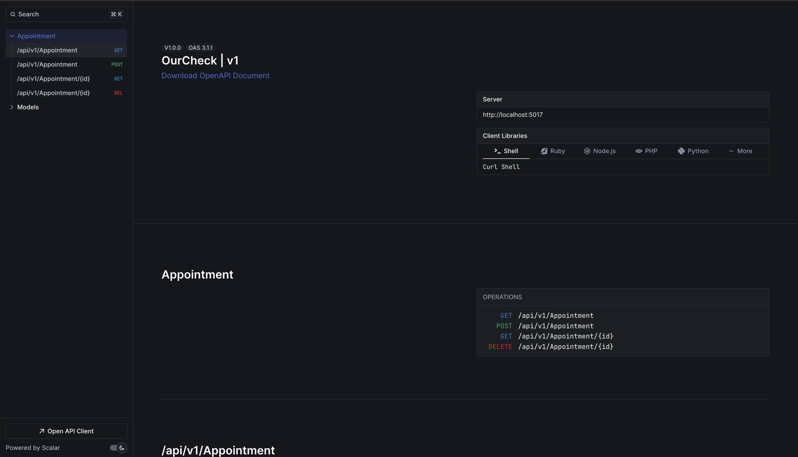

# OurCheck

**A production-ready appointment management system built with ASP.NET Core.** Demonstrates enterprise-level architectural patterns, clean code principles, and modern .NET development practices.

[](https://dotnet.microsoft.com/)
[](LICENSE)
[]()
[](https://www.docker.com/)

---

## 📸 Screenshots


<!-- Add Scalar UI screenshot here -->

---

## ✨ Features

- **Full CRUD Operations** for appointment management
- **RESTful API** with versioning support (v1.0)
- **Interactive API Documentation** powered by Scalar UI
- **Global Exception Handling** with RFC 7807 Problem Details
- **Request/Response Logging** with correlation IDs for traceability
- **Automatic Validation** using FluentValidation pipeline
- **Database Migrations** with Entity Framework Core
- **Data Seeding** for quick development startup
- **Containerized Deployment** with Docker and Docker Compose
- **Health Checks** for PostgreSQL database

---

## 🛠️ Tech Stack

### **Core Framework**
| Technology | Purpose |
|------------|---------|
| **.NET 10** | Runtime and SDK |
| **ASP.NET Core 10** | Web API framework |
| **C# 13** | Programming language |

### **Data Access**
| Technology | Purpose |
|------------|---------|
| **Entity Framework Core 10** | ORM for database operations |
| **Npgsql.EntityFrameworkCore.PostgreSQL** | PostgreSQL provider |
| **PostgreSQL 17 (Alpine)** | Relational database |

### **Architecture & Patterns**
| Technology | Purpose |
|------------|---------|
| **MediatR 12.2** | CQRS and mediator pattern implementation |
| **FluentValidation 11.9** | Model validation |

### **API Documentation**
| Technology | Purpose |
|------------|---------|
| **Scalar 2.1** | Modern API documentation UI |
| **Microsoft.AspNetCore.OpenApi** | OpenAPI specification generation |
| **Asp.Versioning** | API versioning support |

### **Logging & Observability**
| Technology | Purpose |
|------------|---------|
| **Serilog 10.0** | Structured logging |

### **DevOps**
| Technology | Purpose |
|------------|---------|
| **Docker** | Containerization |
| **Docker Compose** | Multi-container orchestration |

---

## 🏗️ Architecture

This project follows **Clean Architecture** principles organized into a **multi-project layered solution**, implementing:

- **CQRS (Command Query Responsibility Segregation)**: Separate models for read and write operations
- **MediatR Pipeline Behaviors**: Cross-cutting concerns handled via:
  - `RequestResponseLoggingBehavior`: Structured logging with correlation IDs
  - `ValidationBehavior`: Automatic request validation before handler execution
- **Repository Pattern**: Abstracted via EF Core DbContext (`IAppDbContext`)
- **Domain-Driven Design**: Domain entities with encapsulated business logic
- **Dependency Inversion Principle**: Application layer defines abstractions, Infrastructure implements them
- **Global Exception Handling**: Centralized error handling with RFC 7807 Problem Details responses
- **API Versioning**: URL segment-based versioning with header fallback support
- **Vertical Slice Architecture**: Features organized by use case (Commands, Queries, DTOs per feature)

### Solution Structure (Layered Architecture)

```
src/
├── OurCheck.Domain/              # 🟦 Core/Domain Layer
│   ├── Entities/                 #    - Appointment, SavedPlace, EntityBase
│   └── README.md                 #    - Zero dependencies (pure domain logic)
│
├── OurCheck.Application/         # 🟩 Application/Use Cases Layer
│   ├── Appointment/              #    - CQRS Commands & Queries
│   │   ├── Commands/             #    - Create, Delete, Update handlers
│   │   ├── Queries/              #    - Get, List queries
│   │   └── Dtos/                 #    - Data Transfer Objects
│   ├── SavedPlace/               #    - SavedPlace feature slice
│   │   ├── Commands/
│   │   ├── Queries/
│   │   └── Dtos/
│   ├── Common/
│   │   ├── Behaviors/            #    - ValidationBehavior, LoggingBehavior
│   │   ├── Interfaces/           #    - IAppDbContext (abstraction)
│   │   └── Constants/
│   ├── DependencyInjection.cs    #    - MediatR + FluentValidation setup
│   └── README.md                 #    - Depends only on Domain
│
├── OurCheck.Infrastructure/      # 🟨 Infrastructure/Data Access Layer
│   ├── Data/
│   │   ├── AppDbContext.cs       #    - EF Core DbContext (implements IAppDbContext)
│   │   ├── Configurations/       #    - Entity type configurations
│   │   └── ApplicationDbContextInitialiser.cs
│   ├── Migrations/               #    - EF Core migration files
│   ├── DependencyInjection.cs    #    - PostgreSQL + EF Core setup
│   └── README.md                 #    - Implements Application abstractions
│
└── OurCheck.API/                 # 🟥 Presentation/API Layer
    ├── Controllers/              #    - AppointmentController, SavedPlaceController
    │   ├── AppointmentController.cs
    │   └── SavedPlaceController.cs
    ├── Exceptions/
    │   └── GlobalExceptionHandler.cs
    ├── Features/                 #    - (Future) Minimal API endpoints
    ├── Program.cs                #    - Application entry point
    ├── DependencyInjection.cs    #    - API versioning, Swagger, CORS
    └── README.md                 #    - Orchestrates all layers
```

### Dependency Flow (Clean Architecture)

```
┌─────────────────────────────────────────────────────────┐
│                    OurCheck.API                         │
│              (Presentation Layer)                        │
│  Controllers, Middleware, Program.cs                     │
└────────────────────┬────────────────────────────────────┘
                     │ depends on
                     ↓
┌─────────────────────────────────────────────────────────┐
│              OurCheck.Infrastructure                     │
│            (Infrastructure Layer)                        │
│  DbContext, Repositories, External Services              │
└────────────────────┬────────────────────────────────────┘
                     │ depends on
                     ↓
┌─────────────────────────────────────────────────────────┐
│              OurCheck.Application                        │
│            (Application Layer)                           │
│  Use Cases, Commands, Queries, Interfaces                │
└────────────────────┬────────────────────────────────────┘
                     │ depends on
                     ↓
┌─────────────────────────────────────────────────────────┐
│              OurCheck.Domain                             │
│              (Core/Domain Layer)                         │
│  Entities, Value Objects, Domain Logic                   │
│  ⚠️ NO DEPENDENCIES - Pure business logic                │
└─────────────────────────────────────────────────────────┘
```

> **📖 Each project contains its own detailed README.md** explaining responsibilities, dependencies, and architectural rules.

---

## 🚀 Getting Started

### Prerequisites

Ensure you have the following installed:

- **.NET 10 SDK** ([Download](https://dotnet.microsoft.com/download/dotnet/10.0))
- **Docker Desktop** ([Download](https://www.docker.com/products/docker-desktop))
- **Entity Framework Core CLI Tools**:
  ```bash
  dotnet tool install --global dotnet-ef
  ```

### Setup Instructions

1. **Clone the repository**
   ```bash
   git clone https://github.com/yourusername/OurCheck.git
   cd OurCheck
   ```

2. **Start PostgreSQL with Docker**
   ```bash
   docker compose up -d
   ```
   This will start a PostgreSQL 17 container on `localhost:5432` with:
   - Username: `admin`
   - Password: `secret`
   - Database: `ourCheck`

3. **Restore NuGet packages**
   ```bash
   dotnet restore
   ```

4. **Add migrations**
   ```bash
   dotnet ef migrations add <MigrationName> --project src/OurCheck.Infrastructure --startup-project src/OurCheck.API
   ```

5. **Apply database migrations**
   ```bash
   dotnet ef database update --project src/OurCheck.Infrastructure --startup-project src/OurCheck.API
   ```
   > **Note:** The database will be seeded automatically on first run with sample data.

6. **Run the application**
   ```bash
   dotnet run --project src/OurCheck.API
   ```

7. **Access the application**
   - **HTTPS**: [https://localhost:7198](https://localhost:7198)
   - **HTTP**: [http://localhost:5017](http://localhost:5017)
   - **API Documentation (Scalar)**: [https://localhost:7198/scalar/v1](https://localhost:7198/scalar/v1)

---

## 📚 API Documentation

Once the application is running, navigate to the **Scalar UI** at:

```
https://localhost:7198/scalar/v1
```

Here you can:
- Explore all available endpoints
- Test API requests interactively
- View request/response schemas
- Download the OpenAPI specification

### Available Endpoints (v1)

#### Appointments
| Method | Endpoint | Description |
|--------|----------|-------------|
| GET | `/api/v1/Appointment` | List all appointments |
| GET | `/api/v1/Appointment/{id}` | Get appointment by ID |
| POST | `/api/v1/Appointment` | Create new appointment |
| PUT | `/api/v1/Appointment/{id}` | Update appointment |
| DELETE | `/api/v1/Appointment/{id}` | Delete appointment |

#### Saved Places
| Method | Endpoint | Description |
|--------|----------|-------------|
| GET | `/api/v1/SavedPlace` | List all saved places |
| GET | `/api/v1/SavedPlace/{id}` | Get saved place by ID |
| POST | `/api/v1/SavedPlace` | Create new saved place |
| PUT | `/api/v1/SavedPlace/{id}` | Update saved place |
| DELETE | `/api/v1/SavedPlace/{id}` | Delete saved place |

---

## 🧪 Testing

```bash
# Run all tests
dotnet test

# Run tests with coverage
dotnet test /p:CollectCoverage=true
```

> **Note:** Test project not yet implemented. See [Future Improvements](#-future-improvements).

---

## 🐳 Docker Deployment

### Build and run with Docker

```bash
# Build the Docker image
docker build -t ourcheck:latest -f src/OurCheck.API/Dockerfile .

# Run the container
docker run -p 5017:8080 --env-file .env ourcheck:latest
```

### Docker Compose (Full Stack)

```bash
# Start all services (API + PostgreSQL)
docker compose up --build

# Stop all services
docker compose down

# Stop and remove volumes
docker compose down -v
```

---

## 🔧 Configuration

### Database Connection

Edit `appsettings.json` to configure your connection string:

```json
{
  "ConnectionStrings": {
    "DefaultConnection": "Host=localhost;Port=5432;Database=ourCheck;Username=admin;Password=secret"
  }
}
```

### Logging

Serilog is configured in `Program.cs`. Default output is console. To configure additional sinks, modify:

```csharp
builder.Host.UseSerilog((context, loggerConfiguration) =>
{
    loggerConfiguration.WriteTo.Console();
    loggerConfiguration.ReadFrom.Configuration(context.Configuration);
});
```

---

## 📊 Database Migrations

```bash
# Add a new migration
dotnet ef migrations add MigrationName --project src/OurCheck.Infrastructure --startup-project src/OurCheck.API

# Update database to latest migration
dotnet ef database update --project src/OurCheck.Infrastructure --startup-project src/OurCheck.API

# Rollback to specific migration
dotnet ef database update PreviousMigrationName --project src/OurCheck.Infrastructure --startup-project src/OurCheck.API

# Remove last migration (if not applied)
dotnet ef migrations remove --project src/OurCheck.Infrastructure --startup-project src/OurCheck.API

# Generate SQL script from migrations
dotnet ef migrations script --project src/OurCheck.Infrastructure --startup-project src/OurCheck.API --output migrations.sql
```

---

## 🚧 Future Improvements

- [ ] Add unit and integration test projects (xUnit, FluentAssertions, Testcontainers)
- [ ] Implement authentication & authorization (JWT/OAuth)
- [ ] Implement soft delete functionality
- [ ] Set up CI/CD pipeline (GitHub Actions/Azure DevOps)
- [ ] Add health check endpoints
- [ ] Implement rate limiting and throttling
- [ ] Add API request/response compression
- [ ] Add monitoring and telemetry (Application Insights/OpenTelemetry)

---

## 🤝 Contributing

Contributions are welcome! Please feel free to submit a Pull Request.

1. Fork the project
2. Create your feature branch (`git checkout -b feature/AmazingFeature`)
3. Commit your changes (`git commit -m 'Add some AmazingFeature'`)
4. Push to the branch (`git push origin feature/AmazingFeature`)
5. Open a Pull Request

---

## 📄 License

This project is licensed under the MIT License - see the [LICENSE](LICENSE) file for details.

---

## 👤 Author

**Dmytro Kudin**

- LinkedIn: [linkedin.com/in/dmytro-kudin-7a038815a](https://www.linkedin.com/in/dmytro-kudin-7a038815a/)
- GitHub: [@dmytro-kudin](https://github.com/dmytro-kudin)

---

## 🙏 Acknowledgments

- Built with modern .NET 10 and ASP.NET Core
- Inspired by Clean Architecture and Vertical Slice Architecture principles
- API documentation powered by [Scalar](https://github.com/scalar/scalar)

---

<div align="center">
  <strong>⭐ If you find this project useful, please consider giving it a star!</strong>
</div>